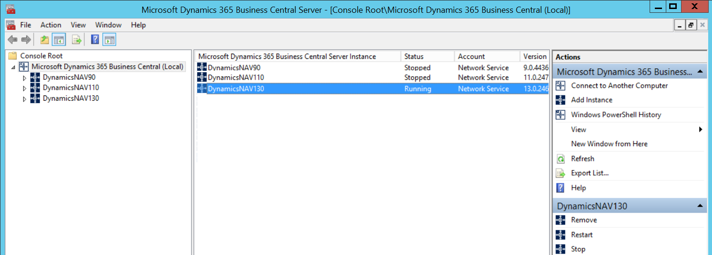

# [!INCLUDE[admintool](../developer/includes/admintool.md)]
The [!INCLUDE[admintool](../developer/includes/admintool.md)] is a Microsoft Management Console \(MMC\) snap-in for creating and managing [!INCLUDE[server](../developer/includes/server.md)] instances. 

> [!TIP]
> You can also administrate your [!INCLUDE[prodshort](../developer/includes/prodshort.md)] deployment using [!INCLUDE[wps_2](../developer/includes/wps_2_md.md)] cmdlets. For more information, see [Microsoft Dynamics 365 Windows PowerShell Cmdlets](/powershell/business-central/overview).   

## Install the [!INCLUDE[admintool](../developer/includes/admintool.md)]

To install [!INCLUDE[admintool](../developer/includes/admintool.md)], use the [!INCLUDE[prodsetup](../developer/includes/prodsetup.md)] and choose either **Server Option** or **Administration Tool** under the custom options page. For more information, see [Installing Business Central Using Setup](../deployment/install-using-setup.md).

## Run the [!INCLUDE[admintool](../developer/includes/admintool.md)]  
You typically run the [!INCLUDE[admintool](../developer/includes/admintool.md)] by choosing **Business Central Administration** from the Start menu. Or, you can open the MMC first and then add the [!INCLUDE[prodshort](../developer/includes/prodshort.md)] snap-in. In this case, choose **Run** from the Start menu and then specify the Microsoft Management Console:  

```
mmc
```

> [!IMPORTANT]  
> Only members of the Administrator group on the computer are able to use the [!INCLUDE[admintool](../developer/includes/admintool.md)].
>  
> The [!INCLUDE[admintool](../developer/includes/admintool.md)] is not supported for multi-user environments.  
  
## Navigating the [!INCLUDE[admintool](../developer/includes/admintool.md)]

[!INCLUDE[admintool](../developer/includes/admintool.md)] is divided into panes:  

-   The left pane shows a tree view that lists all [!INCLUDE[server](../developer/includes/server.md)] computers that you are administering from this computer and all [!INCLUDE[server](../developer/includes/server.md)] instances on those computers.  

       
  
-   The **center pane** shows information about the item that you have selected in the left pane. When the selected item is a computer running [!INCLUDE[server](../developer/includes/server.md)], the center pane shows a list of [!INCLUDE[server](../developer/includes/server.md)] instances on that computer and the status of each instance \(running or stopped\), and the name of the account the instance is running under.  
  
     When the item selected in the left pane is a [!INCLUDE[server](../developer/includes/server.md)] instance, the center pane shows the settings for that instance. For information about a specific setting, see [Configuring Business Central Server Instances](configure-server-instance.md).  
  
-   If the [!INCLUDE[server](../developer/includes/server.md)] is configured for multitenancy, then you can expand the [!INCLUDE[server](../developer/includes/server.md)] instance items in the left pane to display a **Tenants** item. Select the **Tenants** item to display all the tenants that are mounted on a [!INCLUDE[server](../developer/includes/server.md)] instance in the center pane. For more information, see [Multitenant Deployment Architecture](../deployment/Multitenant-Deployment-Architecture.md)  
  
-   The **right pane** displays available actions for the object that is selected in the left pane. These options differ depending on whether a [!INCLUDE[server](../developer/includes/server.md)] computer or a [!INCLUDE[server](../developer/includes/server.md)] instance is selected.  
  
-   The **Windows PowerShell History** pane lists the [!INCLUDE[wps_2](../developer/includes/wps_2_md.md)] commands that the equivalent of the tasks you perform in the [!INCLUDE[admintool](../developer/includes/admintool.md)]. You can access the Windows PowerShell History pane from the **Actions** menu and from the right pane. To run a command that is shown in the **Windows PowerShell History** pane, you can copy the command and paste it into the [!INCLUDE[nav_shell](../developer/includes/nav_shell_md.md)], for example.

## Connect to remote computers and multiple server instances
You can use the [!INCLUDE[admintool](../developer/includes/admintool.md)] to connect to other computers on your network where [!INCLUDE[server](../developer/includes/server.md)] instances are installed, and then manage those instances.

1. Configure the remote computers to receive Windows PowerShell remote commands by running the [Enable-PSRemoting](/powershell/module/microsoft.powershell.core/enable-psremoting) cmdlet on each computer.  
2. Next, you can start the [!INCLUDE[admintool](../developer/includes/admintool.md)].
3. If you want to connect to a single remote computer, you can start the [!INCLUDE[admintool](../developer/includes/admintool.md)] from the Start menu of your computer.
4. If you want to connect to multiple remote computers, you must start the [!INCLUDE[admintool](../developer/includes/admintool.md)] from the **Run** program that you can access in the Start menu, 
    1. Enter the command `mmc`.    
    2.  In the Management Console, on the **File** menu, choose **Add/Remove Snap-in** to open the **Add or remove Snap-ins** dialog box.   
    3.  In the **Available snap-ins** list, double-click **Microsoft Dynamics 365 Business Central**.   
    4.  In the **Connect to another computer** dialog box, type the name of a [!INCLUDE[server](../developer/includes/server.md)] computer in the **Server Name** box, and then choose **OK**.  
    5.  Double-click *Microsoft Dynamics 365 Business Central** again, and then enter the name of a different [!INCLUDE[server](../developer/includes/server.md)] computer in the **Server Name** box. Choose **OK**.  
  
     You can also accept the default value, which is **\(Local\)**, if this is one of the [!INCLUDE[server](../developer/includes/server.md)] computers that you will be administering.  
  
    6. Continue selecting [!INCLUDE[server](../developer/includes/server.md)] computers as needed. When you are finished selecting computers, choose **OK** to close the **Add or remove Snap-ins** dialog box.  
  
     Now you see multiple [!INCLUDE[server](../developer/includes/server.md)] computers listed in the tree view pane of the [!INCLUDE[admintool](../developer/includes/admintool.md)].  
  
    > [!TIP]  
    >  When you close MMC, you are prompted to save your settings to a Microsoft Management Console \(.msc\) file. If you save your settings, then you can use this file to open MMC with your [!INCLUDE[server](../developer/includes/server.md)] computers already listed  

## See Also
[Configuring Business Central Server Instances](configure-server-instance.md)  
[Administration Center API](administration-center-api.md)  
