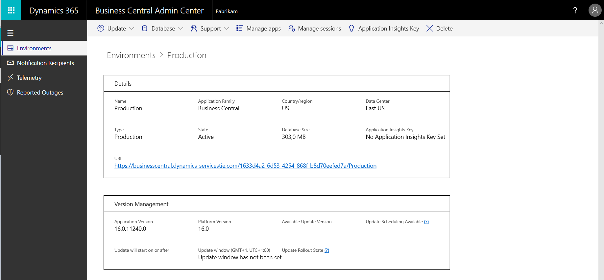

# Managing Environments

The **Environments** tab of the [!INCLUDE[prodadmincenter](../developer/includes/prodadmincenter.md)] provides you with an overview of the [!INCLUDE[prodshort](../developer/includes/prodshort.md)] production and sandbox environments for the tenant, and you can manage updates for each environment.

> [!div class="mx-imgBorder"]
> 

## Viewing details for an environment

In the list of environments, you can open a page with more details for an environment by choosing the link in the **Name** column of the list for the environment.

> [!div class="mx-imgBorder"]
> 

## Types of environments

You can create environments of different types. Which type of environment to choose depends on what you need it for. For more information, see [Production and Sandbox Environments](environment-types.md).  

### Production environments

[!INCLUDE [admin-env-prod](../developer/includes/admin-env-prod.md)]

### Sandbox environments

[!INCLUDE [admin-env-sandbox](../developer/includes/admin-env-sandbox.md)]

[!INCLUDE [perf-demo](../developer/includes/perf-demo.md)]

## Create a new production environment

The [!INCLUDE[prodadmincenter](../developer/includes/prodadmincenter.md)] provides an easy method for creating environments for the tenant. For example, if you have been using a production environment for training purposes, and you have decided to start using [!INCLUDE [prodshort](../developer/includes/prodshort.md)] to run the business, you can delete the original production environment and then create a new production environment.  

> [!NOTE]
> Each [!INCLUDE[prodshort](../developer/includes/prodshort.md)] tenant is limited to three production environments.

To create a production environment:

1. On the **Environments** tab of the [!INCLUDE[prodadmincenter](../developer/includes/prodadmincenter.md)], choose the **New** action on the action ribbon.
2. In the **Create Environment** pane, in the **Environment Type** list, choose **Production**.
3. In the **Country** list, select the country for the environment. The specified country determines the localization for the environment, as well as the Azure region in which the environment is created and stored.
4. Select **Create**.

When the new production environment is created, it will be based on the latest production version of [!INCLUDE[prodshort](../developer/includes/prodshort.md)].

## Create a new sandbox environment

A sandbox environment is a non-production instance of [!INCLUDE[prodshort](../developer/includes/prodshort.md)]. Isolated from production, a sandbox environment is the place to safely explore, learn, demo, develop, and test the service without the risk of affecting the data and settings of your production environment.

> [!IMPORTANT]
> Make sure that you understand the limitations of a sandbox before you create a new sandbox environment. For more information, see [Sandbox environments](environment-types.md#sandbox-environments) section.

> [!NOTE]
> Each [!INCLUDE[prodshort](../developer/includes/prodshort.md)] tenant is limited to three sandbox environments.

To create a sandbox environment:

1. On the **Environments** tab of the [!INCLUDE[prodadmincenter](../developer/includes/prodadmincenter.md)], choose the **New** action on the action ribbon.
2. In the **Create Environment** pane, specify a name for the new environment.
3. In the **Create Environment** pane, in the **Environment Type** list, choose **Sandbox**.
4. Specify if you want the sandbox environment to contain a copy of another environment. If you choose this option, you must specify which environment to copy.
    > [!NOTE]
    > When you create a sandbox environment as a copy of another environment, the new environment is created on the same application version as the environment that you are copying. The new environment will also contain all per-tenant extensions and AppSource extensions that are installed and published in the original environment that is being copied.
5. In the **Country** list, select the country for the environment. The specified country determines the localization for the environment, as well as the Azure region in which the environment is created and stored.
6. Choose the relevant application version for the new sandbox environment from the **Version** list if more than one version is available.
7. Select **Create**.
    > [!NOTE]
    > The sandbox environment will not be accessible until the **State** shows *Active*.

To delete a sandbox environment, choose the environment on the **Environments** tab of the [!INCLUDE[prodadmincenter](../developer/includes/prodadmincenter.md)], and then choose **Delete** on the action ribbon.

### Selecting a version for a new sandbox environment

If you choose to create a sandbox that is not a copy of an existing environment, you must specify an application version for the new environment. The version list will show the latest *production* version, which is the version used for new production environments.

The version list may also have one or more *preview* versions. Preview versions are early release candidates of upcoming releases of [!INCLUDE[prodshort](../developer/includes/prodshort.md)] that are made available specifically for sandbox environments. This gives you access to review new functionality, validate extension compatibility, and other general testing of the upcoming release.

When you create a sandbox environment on a preview version, the environment will automatically be updated to new preview versions when they become available. However, the environment will not be updated to the production version. Once a sandbox environment is on a preview version, it must stay on a preview version until it is deleted. The environment can also be deleted if an update between preview versions fails. We recommend that preview versions are used only for temporary testing of an upcoming release.

## Managing Sessions

The **Manage Sessions** page displays information about active sessions on an environment and lets you cancel selected sessions.

To open the page, select **Manage Sessions**. Use the **Show session details** check box to show more or fewer details.

### Cancel sessions

Canceling a session is sometimes the only way to unblock a customer. For example, a long-running report is locking data in a table, preventing warehouse employees from working.

To cancel a session, select it from the list and then select **Cancel selected sessions**.

## See also

[Working with Administration Tools](administration.md)  
[The Business Central Administration Center](tenant-admin-center.md)  
[Managing Environments](tenant-admin-center-environments.md)  
[Managing Apps](tenant-admin-center-manage-apps.md)  
[Updating Environments](tenant-admin-center-update-management.md)  
[Managing Tenant Notifications](tenant-admin-center-notifications.md)  
[Introduction to automation APIs](itpro-introduction-to-automation-apis.md)  
