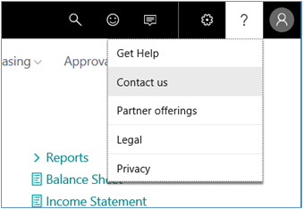

# Components and Capabilities

When you build an app for [!INCLUDE [prodshort](../developer/includes/prodshort.md)], be it an [!INCLUDE[embedapp](../developer/includes/embedapp.md)] or an AppSource app, you must be aware of which components and deployment steps are provided by Microsoft and which you must provide.

## Components

### Base Application

[!INCLUDE [admin-baseapp](../developer/includes/admin-baseapp.md)]

#### Code-customizations of the base application

ISVs can choose to bring their own code-customized base application for several reasons:

- Shortening time-to-market (“lift and shift” approach).

    The ISV's current solution is a significantly customized version of the Microsoft Dynamics NAV application and it will require substantial time and effort to migrate it into extensions. An ISV can lift their solution as-is (upgraded to a supported platform) to [!INCLUDE[[prodshort](../developer/includes/prodshort.md)] service and start offering it to their new and prospective customers. Then, they can gradually start moving their functionality into extensions to achieve the benefits that come with the extension model.  
- Overcoming the limitations of the current extensions framework.

    Extensions today can support many scenarios and the Microsoft team is working on extending these capabilities even more. However, some customization needs of the partners are not yet possible using the current version of the extensions framework, so partners can choose to do these changes directly in the base application using C/SIDE Development Environment based on [!INCLUDE [prodshort](../developer/includes/prodshort.md)] version 14.  
- Availability of 3rd party add-ins as extensions.

    Some of the add-ins required by the [!INCLUDE[embedapp](../developer/includes/embedapp.md)] might not yet be available as extensions, for the reasons mentioned above. The partner can choose to import these add-ins as FOB files into the base application that they submit with the [!INCLUDE[embedapp](../developer/includes/embedapp.md)].  
- Usage of .NET interoperability and custom assemblies.

    ISV partners use .NET interoperability in their current application to address multiple business scenarios. Although extensions today allow a number of these scenarios to be implemented in AL, they don’t and cannot cover for all possible scenarios of .NET usage. Therefore, the partner can choose to import the required .NET add-ins into the Add-ins table of the base application, and these add-ins will automatically be deployed into the environment where they will be running.

Microsoft recommends all ISV’s to move towards a model where the code-customization of the base application is not used. Keep track of new capabilities in the base application and platform in the [release plans](/dynamics365/release-plans/).  

### Platform

[!INCLUDE [msft-platform](../developer/includes/msft-platform.md)]

## Embed Apps

On a high level, an [!INCLUDE[embedapp](../developer/includes/embedapp.md)] is a package that consists of the following parts:

- Library extensions

    This is the functionality of the [!INCLUDE[embedapp](../developer/includes/embedapp.md)] that is implemented by the ISV partner in a form of extensions.  
- Third party extensions  

    These are add-on extensions coming from other ISVs that contribute to and enhance the [!INCLUDE[embedapp](../developer/includes/embedapp.md)]. The extensions are validated to be compatible by the [!INCLUDE[embedapp](../developer/includes/embedapp.md)] owner.  
- Extended metadata  

    This includes additional [!INCLUDE[embedapp](../developer/includes/embedapp.md)] properties that are specific to this type of app and not otherwise available for other types of apps (see the list below).  
- Base application and tenant template (optional)  

The following capabilities are only available for the [!INCLUDE[embedapp](../developer/includes/embedapp.md)] and not for other types of [!INCLUDE[prodshort](../developer/includesprodshort.md)] apps (Connect and Add-on).

### Partner Branding

The [!INCLUDE[embedapp](../developer/includes/embedapp.md)] will promote the ISV brand in several places:

- Web Client and Web Service URLs  
  - Client: `https://[application name].bc.dynamics.com`
  - Web Services: `https://[application name].api.bc.dynamics.com`
- Name, image, and icon on the provisioning page of the Fixed Client Endpoint 
- Splash screen of the client 
- Title bar of the browser tab (for example, “Fabrikam Apples”) 
- A dedicated product tile, icon, and short marketing description in the Dynamics Shell ([https://home.dynamics.com](https://home.dynamics.com))
- In-product messages (such as pop-up errors, warnings, notifications)

  

### Exclusivity

The partner can control which third party apps can be installed for their [!INCLUDE[embedapp](../developer/includes/embedapp.md)].  

- Whitelisting of the 3rd party apps - no other apps will be possible to install, except the ones explicitly approved by the ISV  
- App install/uninstall controlled by the ISV  
- The partner can choose to allow a customer to install other extensions from the AppSource, but this will be an explicit partner decision, not the default behavior  

### Additional settings (metadata)

- An [!INCLUDE[embedapp](../developer/includes/embedapp.md)] is the property of the ISV partner, so the customers of the [!INCLUDE[embedapp](../developer/includes/embedapp.md)] must be able to find the partner’s own legal, privacy, contact, community and feedback links (not Microsoft links) when they work with the app: 

      

- Whitelisted domains for embedding [!INCLUDE[embedapp](../developer/includes/embedapp.md)] pages into other web sites, including SharePoint (“frame ancestors”) 
- Target version of [!INCLUDE[d365_bus_central_md](../developer/includes/d365_bus_central_md.md)] platform 
- Target version of [!INCLUDE[d365_bus_central_md](../developer/includes/d365_bus_central_md.md)] base application (if not included with the [!INCLUDE[embedapp](../developer/includes/embedapp.md)]) 
- Azure KeyVault account for storing ISV application secrets (for example, accounts for connecting to 1-3rd party services) 
- Base application + tenant template. This is an optional component of an [!INCLUDE[embedapp](../developer/includes/embedapp.md)]. The partner can choose to include it or simply specify which version of the [!INCLUDE[d365_bus_central_md](../developer/includes/d365_bus_central_md.md)] base application the [!INCLUDE[embedapp](../developer/includes/embedapp.md)] should use as a base application.

At this stage, within the extensions and base application, the ISV partner can work in their own Object ID range. 

#### Platform version availability

Microsoft is going to make new versions of the [!include[prodshort](../developer/includes/prodshort.md)] platform available to [!INCLUDE [embedapp](../developer/includes/embedapp.md)] ISVs through the LCS portal. The partner will then have to pick the platform they want to use for deployment of their solution.

#### Deploying versions

When deploying a solution via the LCS portal, it will possible to pick from the last 3 available versions of the platform (minor and major). Every newly released minor or major platform update will be added to the list and simultaneously one older version will be removed form that list.  
The existing deployments, running on the platform versions, which are older than 3 updates will enter a grace period of 30 days and after that, if not upgraded, will be moved out of the standard SLA.  

## See Also

[Microsoft Responsibilities](microsoft-responsibilities.md)  
[[!INCLUDE[embedapp](../developer/includes/embedapp.md)] Overview](embed-app-overview.md)  
