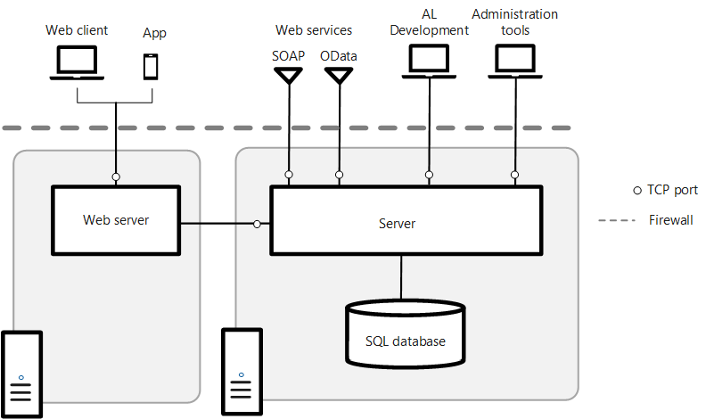

# Deploying [!INCLUDE[prodsshort](../developer/includes/prodshort.md)] in a Two-Computer Topology
In this scenario, you install the [!INCLUDE[webservercomponents](../developer/includes/webservercomponents.md)] on a computer separate than [!INCLUDE[server](../developer/includes/server.md)] and the SQL Server database components.  

   

<!--
> [!TIP]  
>  For a step-by-step example that describes how to deploy this scenario, see [Walkthrough: Installing the Microsoft Dynamics NAV Web Server Components on Two Computers](Walkthrough--Installing-the-Microsoft-Dynamics-NAV-Web-Server-Components-on-Two-Computers.md).
--> 

## Pre-Installation Tasks  
The following table includes tasks to perform before you install the [!INCLUDE[webservercomponents](../developer/includes/webservercomponents.md)].  

|Task|[!INCLUDE[bp_tabledescription](../developer/includes/bp_tabledescription_md.md)]|For more information, see|  
|----------|---------------------------------------|-------------------------------|  
|Make sure that system requirements are met.|Verify that the computer has the required hardware and software installed.|[System Requirements](system-requirement-business-central.md)|  
|Install Internet Information Services.|When you install the [!INCLUDE[webservercomponents](../developer/includes/webservercomponents.md)], [!INCLUDE[prodsetup](../developer/includes/prodsetup.md)] creates a website for the [!INCLUDE[nav_web](../developer/includes/nav_web_md.md)] on IIS. If IIS is already installed, then make sure that the required features are enabled.  **Note:** This step is optional because instead of installing and configuring IIS manually, you can use [!INCLUDE[prodsetup](../developer/includes/prodsetup.md)] to install IIS and enable the required features by setting the **Install IIS Prerequisites** option to **Yes**.|[Configure Internet Information Services](configure-iis.md)|
|Determine the TCP ports for the [!INCLUDE[nav_web](../developer/includes/nav_web_md.md)], client services, and SOAP/OData web services (optional) and allow communication on the port through Windows Firewall.|[!INCLUDE[prodsetup](../developer/includes/prodsetup.md)] creates a website on IIS. During Setup, you will have to choose the port to use for the site. The default port is port 8080.  The default client services port is 7046.  If you will enable SOAP and OData web services, you will also need to specify a port for each. The default ports are 7047 and 7048.  If you choose to do so, [!INCLUDE[prodsetup](../developer/includes/prodsetup.md)] will automatically create an inbound rule in Windows Firewall that allows communication on the ports. Otherwise, you will have to do this manually.|[Create an Inbound Port Rule](https://docs.microsoft.com/en-us/windows/security/identity-protection/windows-firewall/create-an-inbound-port-rule) in the Windows documentation.|  
|Set up the service account for [!INCLUDE[server](../developer/includes/server.md)] and the SQL Server database.|Optional. When you install [!INCLUDE[server](../developer/includes/server.md)], you can specify a user account that will be used to log on to the [!INCLUDE[server](../developer/includes/server.md)] instance and [!INCLUDE[prodshort](../developer/includes/prodshort.md)] database. The default service account is Network Service. If you want to use Network Service, then no action is required for this task.|[Provisioning a Service Account](provision-server-account.md)|  
|Obtain and install an SSL certificate.|Optional. If you want to configure SSL on the connection to [!INCLUDE[nav_web](../developer/includes/nav_web_md.md)], then complete the following procedures:   -   Obtain an SSL certificate. -   Import the certificate into the local computer store of the computer on which you will install the [!INCLUDE[webservercomponents](../developer/includes/webservercomponents.md)]. -   Obtain the certificate's thumbprint.  **Note:**  You can also configure SSL after you have installed the [!INCLUDE[nav_web](../developer/includes/nav_web_md.md)]. For more information, see [Post-installation Tasks](deploy-two-computer-environment.md#PostInstall).|[Configure SSL to Secure the Web Client Connection](configure-ssl-web-client-connection.md)|  

## Installation Tasks  
 The following table includes tasks for installing the [!INCLUDE[webservercomponents](../developer/includes/webservercomponents.md)].  

|Task|Description|For more information, see|  
|----------|-----------------|-------------------------------|  
|On one computer, install [!INCLUDE[server](../developer/includes/server.md)] and SQL Server Database Components on one computer|Run the [!INCLUDE[prodsetup](../developer/includes/prodsetup.md)] setup.exe file, choose **Advanced installation options** > **Choose an installation option** > **Custom**, and then choose the **Server** and **SQL Server Database Components** options.|[Install Business Central Using Setup](install-using-setup.md)|  
|On the other computer, install the [!INCLUDE[webservercomponents](../developer/includes/webservercomponents.md)].|Run [!INCLUDE[prodsetup](../developer/includes/prodsetup.md)], choose **Advanced installation options** > **Choose an installation option** > **Custom**, and then the **Web Server Components** option.|[Install Business Central Using Setup](install-using-setup.md)   [Business Central Web Server Overview](web-server-overview.md)|  
|Configure delegation from the web server to [!INCLUDE[server](../developer/includes/server.md)].|Because [!INCLUDE[server](../developer/includes/server.md)] is running on a different computer than the [!INCLUDE[webservercomponents](../developer/includes/webservercomponents.md)], you must configure the computer that is running [!INCLUDE[webservercomponents](../developer/includes/webservercomponents.md)] to delegate its access to [!INCLUDE[server](../developer/includes/server.md)] on behalf of the device trying to access from the [!INCLUDE[nav_web](../developer/includes/nav_web_md.md)].|[Configure Delegation for Business Central Web Server](configure-delegation-web-server.md)|  

##   Post-installation Tasks  
 The following table includes tasks to configure the [!INCLUDE[webservercomponents](../developer/includes/webservercomponents.md)] after installation. These tasks are optional depending on your organizational and network requirements.  

|Task|Description|For more information, see|  
|----------|-----------------|-------------------------------|  
|Change the user authentication method.|The [!INCLUDE[prodshort](../developer/includes/prodshort.md)] supports the following authentication methods: Windows, UserName, NavUserPassword, and AccessControlService. By default, Windows authentication is used.|[Authentication and User Credential Type](../administration/users-credential-types.md)|
|Secure the connection to the [!INCLUDE[nav_web](../developer/includes/nav_web_md.md)] with SSL.|You can help secure [!INCLUDE[prodshort](../developer/includes/prodshort.md)] data that is transmitted over the Internet by enabling Secure Sockets Layer \(SSL\) on the connection to the [!INCLUDE[nav_web](../developer/includes/nav_web_md.md)].|[Configure SSL to Secure the Web Client Connection](configure-ssl-web-client-connection.md)|   
|Change the configuration of the [!INCLUDE[webserver](../developer/includes/webserver.md)].|There are several parameters in the [navsettings.json configuration file](../administration/configure-web-server.md#WebClientSettingsFile) for the [!INCLUDE[webserver](../developer/includes/webserver.md)] that you can modify to change the behavior of the [!INCLUDE[nav_web](../developer/includes/nav_web_md.md)]. Some of the more common parameters include the [!INCLUDE[server](../developer/includes/server.md)] instance, company, language, time zone, regional settings, session time out, and online Help URL.|[Configuring Business Central Web Server](../administration/configure-web-server.md)|
|Set up multiple [!INCLUDE[nav_web](../developer/includes/nav_web_md.md)] applications on a website.|You can set up multiple web server instances for the [!INCLUDE[nav_web](../developer/includes/nav_web_md.md)] on the existing website. The web server instances will use the same address \(URL\) except with an alias that specifies the specific application.|[Creating and Managing [!INCLUDE[webserver](../developer/includes/webserver.md)] Instances Using PowerShell](configure-multiple-web-server-instances.md)|  
|Configure web browsers on devices.|The [!INCLUDE[nav_web](../developer/includes/nav_web_md.md)] supports several different web browsers. To access the [!INCLUDE[nav_web](../developer/includes/nav_web_md.md)], the web browser must be enabled on a device with cookies and JavaScript.|[Web Client Requirements](system-requirement-business-central.md#WebClient)|  

## See Also  
 [Business Central Web Server Overview](web-server-overview.md)   
 [Installing Business Central in a Single Computer Environment](deploy-single-computer-environment.md)   
 [Installing Business Central in a Three Computer Environment](deploy-three-computer-environment.md)
