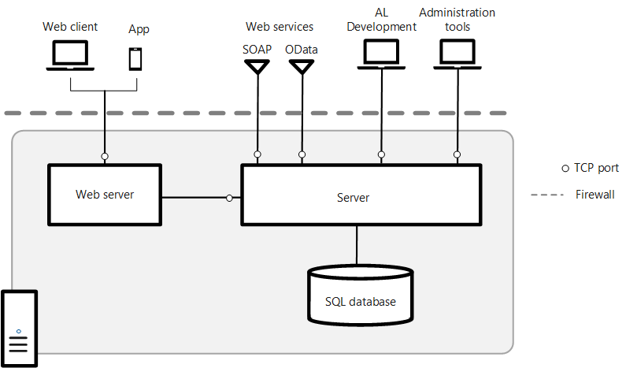

# [!INCLUDE[webserver](../developer/includes/webserver.md)] Overview

Giving users access to data from the [!INCLUDE[nav_web](../developer/includes/nav_web_md.md)], companion app, and Outlook add-in requires a Internet Information Services (IIS) website as part of your deployment. The website, which we refer to as [!INCLUDE[webserver](../developer/includes/webserver.md)] instance, hosts the files that provide content and services to client users over the Internet. This article highlights several factors to consider to help you set up [!INCLUDE[webserver](../developer/includes/webserver.md)] instances that suit your deployment requirements.

If you just want to get started installing the [!INCLUDE[webservercomponents](../developer/includes/webservercomponents.md)], see [Install Business Central Using Setup](install-using-setup.md).

## ASP .NET Core on IIS
[!INCLUDE[webserver](../developer/includes/webserver.md)] instances run on ASP.NET Core on IIS, which in part dictates the directory structure of the instances. For more information about ASP .NET Core, see [Introduction to ASP.NET Core](/aspnet/core/).

## Network Topology
The following illustration shows the component infrastructure that supports [!INCLUDE[webserver](../developer/includes/webserver.md)] instances on your network.  

    

Each [!INCLUDE[webserver](../developer/includes/webserver.md)] instance must connect to a [!INCLUDE[server](../developer/includes/server.md)], which in turn connects to the database that contains the application and business data. Multiple [!INCLUDE[webserver](../developer/includes/webserver.md)] instances can connect to the same [!INCLUDE[server](../developer/includes/server.md)]. You can deploy these components on one computer or on separate computers. For example, you can install the [!INCLUDE[webserver](../developer/includes/webserver.md)] instance on one computer and the [!INCLUDE[server](../developer/includes/server.md)] and SQL Server database on another computer. The topology that you choose depends on the network resources and the infrastructure of the [!INCLUDE[prodshort](../developer/includes/prodshort.md)] components. The installation and configuration process is different for each scenario.

For information about the common deployment scenarios, see [Deployment Topologies](deployment-scenarios.md).  

##  Creating a [!INCLUDE[webserver](../developer/includes/webserver.md)] instance  

There are two ways to create a [!INCLUDE[webserver](../developer/includes/webserver.md)] instance. You can use the [!INCLUDE[prodsetup](../developer/includes/prodsetup.md)] Setup or the [!INCLUDE[webserver](../developer/includes/webserver.md)] PowerShell cmdlets.

### Using [!INCLUDE[prodsetup](../developer/includes/prodsetup.md)] Setup
Setup is the quickest way to get a web server instance up and running, and is typically how you install the first [!INCLUDE[webserver](../developer/includes/webserver.md)] instance in your deployment.

-   Setup installs the [!INCLUDE[webservercomponents](../developer/includes/webservercomponents.md)], which does the following:

    -   Installs and configure IIS with the required prerequisites, including Microsoft .NET Core - Windows Server Hosting <!--[Microsoft .NET Core - Windows Server Hosting package](https://aka.ms/dotnetcore.2.0.0-windowshosting)-->
    -   Installs a web server instance on IIS.
    -   Installs components and files in a **WebPublish** folder that enables you to add additional web server instances without having to use the [!INCLUDE[prodshort](../developer/includes/prodshort.md)] installation media (DVD).

-   You can only use Setup to install a single [!INCLUDE[webserver](../developer/includes/webserver.md)] instance.

-   Setup does not let you choose the site deployment type for the web server instance. By default, it creates a SubSite instance. For more information, see [Site Deployment Types](configure-multiple-web-server-instances.md#WebClientonIIS).    
For information about how to install the [!INCLUDE[webservercomponents](../developer/includes/webservercomponents.md)], see [Install Business Central Using Setup](install-using-setup.md).

### Using [!INCLUDE[webserver](../developer/includes/webserver.md)] PowerShell cmdlets
There are several PowerShell cmdlets that enable you to create, configure, and remove [!INCLUDE[webserver](../developer/includes/webserver.md)] instances from a command line interface. To create a web server instance, you use the [New-NAVWebServerInstance](/powershell/module/microsoft.dynamics.nav.management/new-navwebserverinstance) cmdlet, which has the following advantages over Setup:

-   You can create multiple web server instances.

-   You have more flexibility regarding the [site deployment type](configure-multiple-web-server-instances.md#WebClientonIIS) of the [!INCLUDE[webserver](../developer/includes/webserver.md)] instances on IIS. For example, you can create a root-level website instance  or a subsite application instance under a container website.

> [!IMPORTANT]
>Using  New-NAVWebServerInstance cmdlet requires that Microsoft .NET Core Windows Server Hosting is installed and IIS is installed and configured with the prerequisites. So unless you have previously installed the [!INCLUDE[webservercomponents](../developer/includes/webservercomponents.md)] by using Setup, you will have to install and configure the prerequisites manually. For more information about the prerequisites, see
[Configure Internet Information Services](configure-iis.md).

For information about how to create a [!INCLUDE[webserver](../developer/includes/webserver.md)] instance by using the New-NAVWebServerInstance cmdlet, see [Creating and Managing [!INCLUDE[webserver](../developer/includes/webserver.md)] Instances Using PowerShell](../deployment/configure-multiple-web-server-instances.md).

## Deployment Phases  
 Typically, you will deploy the [!INCLUDE[nav_web](../developer/includes/nav_web_md.md)] in phases, which can influence the network topology and security settings that you deploy. For example, in the development phase, you develop, test, and fine-tune the application. In this phase, you might consider deploying the [!INCLUDE[nav_web](../developer/includes/nav_web_md.md)] in a single-computer scenario. When you move to the production phase, you deploy the [!INCLUDE[nav_web](../developer/includes/nav_web_md.md)] in the full network infrastructure.  

## Security  

### User Authentication  
 [!INCLUDE[prodshort](../developer/includes/prodshort.md)] supports four methods for authenticating users who try to access the [!INCLUDE[nav_web](../developer/includes/nav_web_md.md)]: Windows, UserName, NavUserPassword, and AccessControlService. Windows authentication is configured by default. For more information, see [Users and Credential Types](../administration/users-credential-types.md) and [Authentication and User Credential Type](../administration/users-credential-types.md).  

### Service Account for [!INCLUDE[server](../developer/includes/server.md)] and [!INCLUDE[prodshort](../developer/includes/prodshort.md)] Database Access  
 When you install [!INCLUDE[server](../developer/includes/server.md)] and [!INCLUDE[prodshort](../developer/includes/prodshort.md)] database components, you must identify an Active Directory account to provide credentials for the servers. By default, Setup runs [!INCLUDE[server](../developer/includes/server.md)] and the [!INCLUDE[prodshort](../developer/includes/prodshort.md)] database under the Network Service account, a predefined local account that is used by the service control manager.  

> [!TIP]  
>  We recommend that you create and use a domain user account for running [!INCLUDE[server](../developer/includes/server.md)] and accessing the [!INCLUDE[prodshort](../developer/includes/prodshort.md)] database. The Network Service account is considered less secure because it is a shared account that can be used by other unrelated network services.  

For more information, see [Provisioning a Service Account](provision-server-account.md).  

### Securing the Connection to Microsoft Dynamics NAV Web Client With SSL  
You can help secure [!INCLUDE[prodshort](../developer/includes/prodshort.md)] data that is transmitted over the Internet by enabling Secure Sockets Layer \(SSL\) on the connection to the [!INCLUDE[nav_web](../developer/includes/nav_web_md.md)]. You can configure SSL when you install the [!INCLUDE[webservercomponents](../developer/includes/webservercomponents.md)] or after the installation.  

 For more information, see [Configure SSL to Secure the Web Client Connection](configure-ssl-web-client-connection.md).  

## See Also  
 [Configure Internet Information Services](configure-iis.md)  
 [Configuring-the Business Central Web Server](../administration/configure-web-server.md)  
