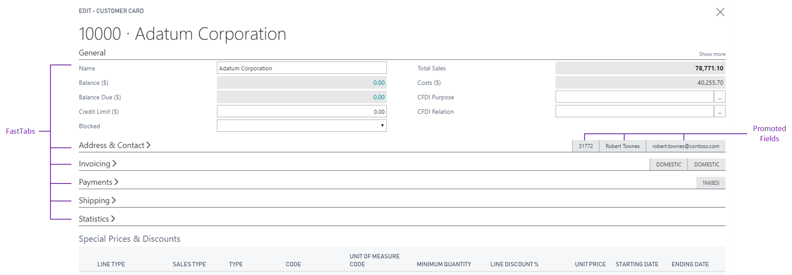

# Field Arrangement on FastTabs
FastTabs in [!INCLUDE[d365fin_long_md](includes/d365fin_long_md.md)] allow users to find key information on a page by displaying the data in separate groups. This topic describes how individual fields are arranged on a FastTab and ways that you can change the layout. 

## How fields are arranged on a FastTab of a page  
By default, a FastTab is divided into two columns for containing fields. Fields are automatically distributed between the left and right columns based on their order in Page Layout and height on the rendered page. Starting with the first field in the Page Layout and working downward, fields are positioned in the left column and then in the right column so that the area that is occupied by the fields in each column is as equal as possible. Field captions are positioned to the left of fields. 

 

## Grouping fields on a FastTab  
By using the Group subtype control in a FastTab, you can include fields on a FastTab in separate groups. This gives you control over how fields are distributed between the left and right columns. When you group fields on a FastTab, the groups and not the individual fields are distributed evenly between the left and right columns.  

FastTabs replace tabs and enable you to place data in groups on card or task pages. If a group is expanded you see all the fields in a group. If it is collapsed you just see the summary line. The summary line is the header that displays a name for the group, such as 'Communication' and can include promoted fields such as 'E-mail'. Promoting fields to the summary line enables you to present key information to the user, even if the control is collapsed. 

Organizing data using FastTabs helps users to find key information quickly, while at the same time giving an overview of areas that otherwise would remain hidden. For example, the customer card page displays customer information in the following categories: General, Communication, Invoicing, Payments, Shipping, and Foreign Trade. Each category is a separate group that can be expanded or collapsed, making it easier for users to focus on one area at a time. On task pages, a FastTab typically represents a single step in a task. 
  
## Manually arranging fields in multiple rows and columns  

Using the GridLayout or FixedLayout controls, you can arrange fields in multiple rows and columns in a grid-like format. For more information, see [Arranging Fields Using Grid and Fixed Controls](devenv-arranging-fields-using-grid-and-fixed-controls.md).

## See Also
[Arranging Fields Using Grid and Fixed Controls](devenv-arranging-fields-using-grid-and-fixed-controls.md)  
[Pages Overview](devenv-pages-overview.md)  
[Using Designer](devenv-inclient-designer.md)  
[Table in [!INCLUDE[d365fin_long_md](includes/d365fin_long_md.md)]](devenv-tables-overview.md)  
