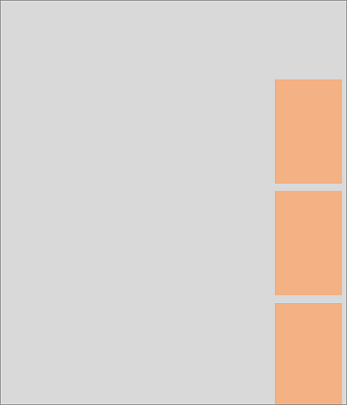
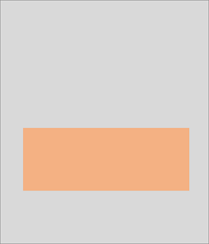
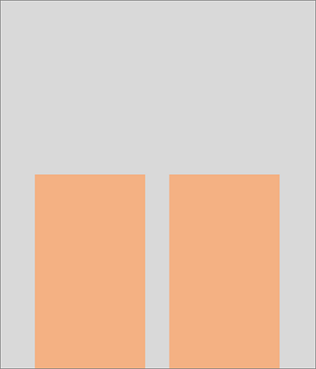

# Page Parts Overview

Parts are a special category of page that are intended to be embedded within another page. The hosting page can be composed of one or more page parts. This is useful when designing richer user experiences, displaying information from a table that is different from the source table of the hosting page, and is a great way to reuse your code across multiple pages.

## Hosting parts on a page
The following table illustrates how parts can be creatively arranged on a page to deliver unique experiences.

|Illustration of pattern|Typical usage|
|---|---|
||Pages of type **Role Center** are typically composed of multiple page parts that display business headlines, KPIs and other cues to help users get an overview of their work.|
||Most page types can display a number of FactBoxes in the FactBox pane, that display information related to the current record.|
||Pages of type **Document** are  used to model transactional data which typically consists of a header and detailed lines. Since these records come from different tables, a part is used to display lines that originate from a related table.|
||Related lists can be displayed above eachother. This is a common pattern allowing one list to be filled by the selected record of another list.|
||When records from two tables need to be compared together, parts can be displayed side by side.|

## Different types of parts
Business Central offers different types of parts for embedding within other pages.

|PageType|Purpose|Recommended use|
|----|---|---|
|[ListParts](devenv-designing-listparts.md)|Display a list of records|- Role Centers  - FactBoxes on pages of type Card, Document, Worksheet, List, ListPlus - Tabular step in a Wizard - Subpage on a Document page|
|[CardParts](devenv-designing-cardparts.md)|Flexible canvas that can be used to display almost any page controls, such as fields, cue tiles, charts, images or control addins.|- Role Centers - FactBoxes on pages of type Card, Document, Worksheet, List, ListPlus - Step in a Wizard|
|[HeadlineParts](devenv-create-role-center-headline.md)|Display relevant insights from across the business|Role Centers only|

## Adding a part to a page
To add a part to a page in Visual Studio Code, you add a part control on the hosting page object that references the page part object. The part control also defines a small set of properties, such as the caption that will accompany the part. This allows separation of responsibility: the page part object defines self-contained functionality, whilst the hosting page defines how the part should behave without knowledge of its' functionality.

For more information aboute the properties of a part control, see [Page Properties](properties/devenv-page-property-overview.md).

## Design considerations

### Part size
The size of a part is automatically determined by the client and will vary depending on where the part has been embedded on the page, other content surrounding the part, and the overall available space of the display target. Developers cannot specify the preferred, minimum or maximum height or width of a part.

### Good to know
- Parts can either represent self-contained functionality, or can be contextual and exchange information with the hosting page.
- A part cannot be hosted within another part. Business Central allows a maximum of one level of page nesting.
- Parts cannot be placed within repeater controls.
- Parts can be made visible programmatically, for example, depending on whether the feature has been set up by administrators.
- Parts are not intended to be displayed on their own without a hosting page.
- Business users can hide parts or show hidden parts on the hosting page.
- When implementing pages to suit a variety of customers, departments or business users, it is common practice to make visible the parts that are generally applicable, and hide the parts that are only valuable to some categories of users.

## See Also
[AL Development Environment](devenv-reference-overview.md)  
[FactBoxes](devenv-adding-a-factbox-to-page.md)  
[Designing pages with multiple lists](devenv-designing-multilist-pages.md)
[Page Extension Object](devenv-page-ext-object.md)  
[Personalizing Your Workspace](https://docs.microsoft.com/dynamics365/business-central/ui-personalization-user)  
[Using Designer](devenv-inclient-designer.md)  
