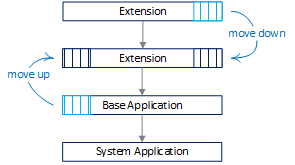
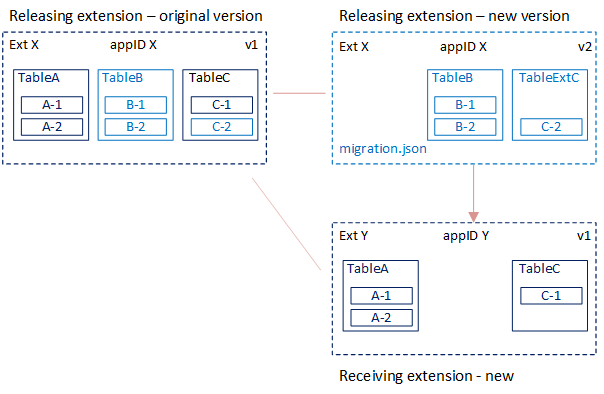
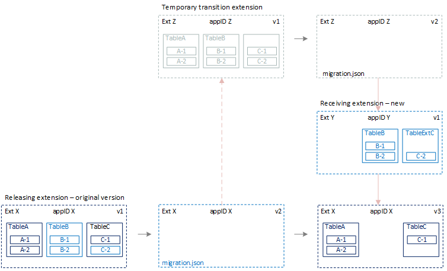

# Migrating Tables and Fields Between Extensions

[!INCLUDE[2020_releasewave1](../includes/2020_releasewave1.md)]

Data migration allows you to move table and field data between extensions. The concepts and processes in this article apply to large-scale and small-scale data migrations. A large-scale migration is typically upgrade scenario, like upgrading from [!INCLUDE[prodshort](../developer/includes/prodshort.md)] version 14 to version 16. Small-scale migrations are scenarios where you want to move a limited number of objects from one extension to another.


## Overview

The move is divided into two phases: development and deployment. However, before you begin, you have to determine the direction of the migration within the dependency graph.

### Limitations

- The concepts discussed in this article pertain only to AL. They're not supported in C/AL.
- You can only move fields from a table object to a table extension or move entire tables from one extension to another.
- You can't:
    - Move table extensions to other extensions.
    - Merge multiple table extensions into one extension.
    - Split table extensions into multiple extensions.

    Although you can't use this feature for these scenarios, you can achieve the scenarios by other means, which require more manual work. Examples include obsoleting, copying/re-ID/renaming, moving data, and more. 

### Determining the migration direction in the dependency graph

The process to migrate tables and fields to another extension depends on the migration's direction in the dependency graph. The following figure illustrates a simplified extension dependency graph. From top to bottom, an extension is dependent on any extension below it in the graph.

  

##### When to move down

Typical move-down scenarios include:

- Moving to a shared extension.

    You want to move common tables to a separate extension that other extensions can have a dependency on.

- Transitioning from a customized base application extension with its own ID to an extension on top of the Microsoft Base Application.

    You have a customized base application extension with its own ID. You want to transition to the Microsoft Base Application. In this case, customizations remain in the current extension. Base objects are removed and ownership transferred to Microsoft Base Application.
    
    This scenario is typical for embed ISV apps and on premises solutions moving to the cloud. It's also relevant for solutions that will remain on-premises for the foreseeable future. Use it to refactor code customizations into cleaner, standard base with extensions as part of upgrading.


<!--
Moving from code customized base app with own appId to extension on top of base app, i.e., some on-prem solutions and all embed ISVs (note, System app would also apply then)
Ext Y might not be owned, i.e., not possible to make modifications in it (e.g., Microsoft standard base app)

-->
<!--
- [add more]
<!--
- Moving objects to an extension that depends on an extension that you don't own, like the Microsoft Base Application or System Application.-->
##### When to move up

Typical move-up scenarios include:

- Splitting an extension in two, with one dependent on the other.

- Extracting the system application from the base application.

- Transitioning from a customized base application extension with Microsoft ID to the Microsoft Base Application.

    You have a customized base application extension that reuses the Microsoft application ID. You want to transition to the standard Microsoft Base Application. In this case, customizations are moved out of the base application up into new extensions. The new extensions have new application IDs and dependencies to the standard Microsoft base application. The customization objects are removed from the custom base application and ownership transferred to the new extensions.

#### Development

Development involves making application code changes required for the move. In short, the work involves:

- Creating the *releasing extension* version

    You create a new version of the original extension. This new version contains the tables or fields you want to keep in the extension. The tables and fields that you want to move are deleted from this extension. They're moved to the *receiving extension*.
- Creating the *receiving extension*

    You create new extension that includes the table and fields that you want moved. It essentially includes those tables and fields deleted from the releasing extension.

The key to the move is the *migration.json* file. You add the file to the project for the releasing extension. This file provides a pointer to the ID of new receiving extension where tables and fields are to be moved to. The *migration.json* is used in the deployment phase. Its purpose is to transfer ownership of tables and fields in the database from one extension to another. For more information, see [Migration.json File](devenv-migration-json-file.md).

#### Deployment

The deployment phase is when the data is migrated to new tables in the database. In this phase, ownership of tables and fields is switched from one extension to another. Deployment involves publishing, syncing, upgrading, and installing extensions.

The order that you synchronize extensions is important:

- The receiving extensions must be synchronized first.
- The releasing extensions, which include those extensions that include the migration.json file, must be synchronized last.

    These extensions are synchronized last because the tables are moved during the synchronization of the releasing extensions. At the end of the synchronization process, the system checks for breaking changes introduced by the extension. If the extension isn't synchronized last, breaking changes will be detected.

## Move tables and fields down the dependency graph

This section explains how to migrate tables and fields down the dependency graph. The steps are based on the example illustrated in the following figure. Although your scenario is different, the concept and process are much the same.

 

In the example, **TableB** and **Field C-2** are customizations. You'll keep these elements in the original extension, but create a new version without **TableA** and **TableC**. You'll move **TableA** and **TableC** down the dependency chain to a new, separate extension.

### Create the receiving extension (Ext Y)

The receiving extension will contain the table and fields that you want to move. In this example, these objects include **TableA** and **TableC**.

1. Create an AL project for the receiving extension.

2. Add a table object definition for **TableA**.

    The table definition (schema) must include the full schema of the releasing extension **Ext X**, with the same field definitions. You can add new fields.

3. Add a table object definition for **TableC**.

    The table definition (schema) must include the full schema of the releasing extension **Ext X**, with the same field definitions, except don't include field **C-2**. You can add new fields.

4. Make a note of the `ID` of the new extension. You'll use this ID in the next task.

    For purposes of the example, the ID is `11111111-aaaa-2222-bbbb-333333333333`.

5. Compile the extension package.

### Create a new version of the releasing extension (Ext X v2)

1. In the releasing extension AL project, add a migration.json file that points to the ID of the target extension.

    ```
    { 
    "apprules": [ 
        { 
            "id": "11111111-aaaa-2222-bbbb-333333333333"
        } 
    ] 
    } 
    ```

    For more information, see [The Migration.json File](devenv-migration-json-file.md).

2. Modify the app.json file as follows:

    - Increase the `"version"` value.
    - In the `""dependencies"` parameter, set up a dependency on the new receiving extension **Ext Y**.

    For more information, see [App.json file](devenv-json-files.md#Appjson).
3. Complete the following steps for **TableC**.

    1. Add a table extension object **TableExtC**.
    2. In table extension object **TableExtC**, add a field definition for field **C-2** that matches its definition in the original **TableC** object.
    3. Delete the original **TableC** object.

4. Delete the entire table object for **TableA**.
5. Compile a new version of the extension package.

### Deploy the extensions

1. Uninstall the old version of the releasing extension **Ext X**.

2. Publish the new receiving extension **Ext Y** and releasing extension version **Ext X v2**.

3. Synchronize the receiving extension **Ext Y**.

    This step creates empty database tables for **TableA** and **TableC** that are owned by the receiving extension **Ext Y**.

    > [!IMPORTANT]
    > The receiving extension must always be synchronized first.

4. Synchronize the new version of the releasing extension **Ext X v2**.

    This step first reads rules in the migration.json file of the extension, then does the following operations in the database:

    <!--
    - Migrates the data from the original tables **TableA** and **TableC** to the receiving extension tables.
    - Deletes the original tables  **TableA** and **TableC** owned by the releasing extension **Ext X**.
    - Deletes column **C-1** from the releasing table **Ext X**.
    -->
    
    - Creates a companion table for field **C-2** of the table extension object **TableExtC**.
    - Copies data from column **C-2** in the original **TableC** to new companion table **TableExtC**.
    - Temporarily renames the new empty tables **TableA** and **TableC** made by receiving extension **Ext Y**. 
    - Renames the original tables **TableA** and **TableC** that include the data. Instead of including the ID of the releasing extension **Ext X**, the names are changed to include the ID of the receiving extension **Ext Y**. This step essentially transfers ownership from **Ext X** to **Ext Y**.
    - Deletes the unused column for **C-2** in the original table **TableC**.
    - Deletes the empty, renamed tables of **Ext Y**.

5. Install the receiving extension **Ext Y**.
6. Run [Start-NAVAppDataUpgrade cmdlet](/powershell/module/microsoft.dynamics.nav.apps.management/start-navappdataupgrade) on the new releasing extension version **Ext X v2**.  

    This step basically installs the new extension version. You run a data upgrade because an earlier version has been installed and is still published.

## Move tables and fields up the dependency graph

This section explains how to migrate tables and fields up the dependency graph. The steps are based on the example illustrated in the following figure. Although your scenario is different, the concept and process are much the same.


In the example, **TableB** and **Field C-2** are customizations. You'll move these elements from the original extension up to a new extension. This new extension will have a dependency on the original extension. You'll keep **TableA** and **TableC** in the original extension.

To accommodate data migration, you'll have to create an extension that is only used for deployment. This extension is **Ext Z** in the figure. There are two stages of deployment:



- In the first stage, **Ext Z** temporarily takes ownership of tables and fields from **Ext X**.
- In the second stage, **Ext Z** releases ownership to extensions **Ext X** and **Ext Y**. You delete transition extension when you finish deployment.

This process is a two-step process because we only support moving down the dependency graph. So instead, the concept is to first move the tables' ownership  to an extension above the receiving extensions in the dependency graph. Then, the extensions are moved down. This concept essentially turns the process into a two-step, move-down process.

**Ext Z** is used just as a temporary extension for moving ownership. So, it only includes schema objects. As a result, customers can't run on the tenant until both steps have been done.

> [!NOTE]
> You can only use this process for on-premise solutions. 

### Create the transition extension (Ext Z v1)

The transition extension will contain replicas of all table object definitions in the releasing extension, except logic code. In the illustration, these objects include **TableA**, **TableB**, and **TableC** and current their field definitions. The transition extension is **Ext Z**.

1. Create an AL project for the transition extension.

2. Add a table object that exactly matches the table object definitions for **TableA**, **TableB**, and **TableC** in the releasing extension.

3. Compile the extension package.

3. Make a note of the `ID` of the new extension. You'll use this ID in the next task.

    For purposes of the example, the ID is `11111111-aaaa-2222-bbbb-333333333333`.

### Create an empty version the releasing extension (Ext X v2)

In this step, you create a new version of the releasing extension that doesn't contain any objects. It only contains a `migration.json` file that points to **Ext Z**.

1. In the releasing extension AL project, add a migration.json file that points to the ID of the transition extension **Ext Z**.

    ```
    { 
    "apprules": [ 
        { 
            "id": "11111111-aaaa-2222-bbbb-333333333333"
        } 
    ] 
    } 
    ```

    For more information, see [The Migration.json File](devenv-migration-json-file.md).
2. Delete all objects from the extension. The objects include **TableA**, **TableB**, and **TableC**.
3. In the app.json file, increase the `version` value.
4. Compile a new version of the extension package.

### Create a receiving extension (Ext Y v1)

You now create a new extension that contains the customization you want to move from the releasing. In this example, the customizations include **TableB** and a **TableExtC**.

1. Create an AL project for **Ext Y**.
2. In the app.json file, set up a dependency on the releasing extension **Ext X**.
3. Add a table definition and code for **TableB** that exactly matches the definition in the original releasing extension.
4. Add a table extension object called **TableExtC**. Then, add a field definition for field **C-2** that matches its definition in the original **TableC** object of the releasing extension.
5. Compile the extension package.
6. Make a note of the `ID` of the new extension. You'll use this ID in the next task.

    For purposes of the example, the ID is `44444444-cccc-5555-dddd-666666666666`.

### Create a final version of releasing extension (Ext X v3)

In this step, you create another version of the releasing extension **Ext X**. This version will contain the objects and code that you want to finally publish.

1. Create an AL project for **Ext X**.
2. Add a table definition and code for **TableA** that exactly matches the definition in the original releasing extension.
3. Add a table object for **TableC** and field definition for **C-1** that matches the definitions in the original **TableC** object of the releasing extension.
3. In the app.json file, increase the `version` value.
4. Compile the extension package.

### Create new empty version of transition extension (Ext Z v2)

In this step, you create a new version of **Ext Z** that only contains a `migration.json` file. This `migration.json` file points the IDS of **Ext X** and **Ext Y**. The file is used to release ownership.

1. In the extension AL project, add a migration.json file that points to the IDs of the releasing extension **Ext X** and receiving extension **Ext Y**.

    ```
    { 
    "apprules": [ 
        { 
            "id": "11111111-aaaa-2222-bbbb-333333333333"
        }
        { 
            "id": "44444444-cccc-5555-dddd-666666666666"
        }
    ] 
    } 
    ```

    For more information, see [The Migration.json File](devenv-migration-json-file.md).

2. Delete the object definitions for **TableA**, **TableB**, and **TableC**.
3. In the app.json file, increase the `version` value.
4. Compile the extension package.

### Deploy the extensions

1. Uninstall the current version of the releasing extension **Ext X**.
2. Complete the following steps for the first stage of deployment:

    1. Publish the transition extension **Ext Z** and empty version of **Ext X v2**.
    2. Synchronize the transition extension **Ext Z**.
    
       This step creates empty database tables **TableA**, **TableB**, and **TableC** that are owned by **Ext Z**.

       > [!IMPORTANT]
        > Extensions receiving table objects must be synced first. Extension releasing/giving away table objects must be synced last.

    3. Synchronize the releasing extension **Ext X v2**.

        This step will read the migration.json of the extension. Then transfer ownership of the original tables **TableA**, **TableB**, and **TableC** to **Ext Z**.

2. Complete the following steps for the second stage of deployment:

    1. Publish the next version for **Ext Z v2** and **Ext X v3**, and the first version of **Ext Y**.
    2. Synchronize the extensions in the following order: **Ext X v3**, **Ext Y v1**, and **Ext Z v2**.

       Synchronize **Ext Z v2** last. When you synchronize **Ext Z v2**, ownership of the tables is transferred from **Ext Z** to **Ext X** and **Ext Y**.
      
5. Install the new receiving extension **Ext Y v1**.
6. Run [Start-NAVAppDataUpgrade cmdlet](/powershell/module/microsoft.dynamics.nav.apps.management/start-navappdataupgrade) on the new releasing extension version**Ext X v3**.

    This step basically installs the new extension version. You run a data upgrade because an earlier version has been installed and is still published.

7. Unpublish both versions of **Ext Z**.

<!--
PS C:\Windows\system32> Publish-NAVApp bc160 -Path "C:\Users\jswymer\Documents\AL\ExtX\Default publisher_ExtX_1.0.0.0.app" -SkipVerification
PS C:\Windows\system32> Sync-NAVApp bc160 -Name extx
PS C:\Windows\system32> install-NAVApp bc160 -Name extx
PS C:\Windows\system32> Publish-NAVApp bc160 -Path "C:\Users\jswymer\Documents\AL\ExtZ\Default publisher_ExtZ_1.0.0.0.app" -SkipVerification
PS C:\Windows\system32> Publish-NAVApp bc160 -Path "C:\Users\jswymer\Documents\AL\ExtX-1\Default publisher_ExtX_1.0.0.1.app" -SkipVerification
PS C:\Windows\system32> Sync-NAVApp bc160 -Name extZ
PS C:\Windows\system32> Sync-NAVApp bc160 -Name extX -Version 1.0.0.1
PS C:\Windows\system32> Publish-NAVApp bc160 -Path "C:\Users\jswymer\Documents\AL\ExtZ-1\Default publisher_ExtZ_1.0.0.2.app" -SkipVerification
PS C:\Windows\system32> Publish-NAVApp bc160 -Path "C:\Users\jswymer\Documents\AL\ExtX - 2\Default publisher_ExtX_1.0.0.2.app" -SkipVerification
PS C:\Windows\system32> Publish-NAVApp bc160 -Path "C:\Users\jswymer\Documents\AL\ExtY\Default publisher_ExtY_1.0.0.0.app" -SkipVerification
PS C:\Windows\system32> Sync-NAVApp bc160 -Name extX -Version 1.0.0.2
PS C:\Windows\system32> Sync-NAVApp bc160 -Name extY -Version 1.0.0.0
PS C:\Windows\system32> Sync-NAVApp bc160 -Name extZ -Version 1.0.0.2
PS C:\Windows\system32> uninstall-NAVApp bc160 -Name extX -Version 1.0.0.0
PS C:\Windows\system32> Start-NAVAppDataUpgrade bc160 -Name extX -Version 1.0.0.2
PS C:\Windows\system32> install-NAVApp bc160 -Name extY -Version 1.0.0.0
PS C:\Windows\system32> Start-NAVAppDataUpgrade bc160 -Name extX -Version 1.0.0.2
-->

## See Also

[Publishing and Installing an Extension](devenv-how-publish-and-install-an-extension-v2.md)  
[JSON Files](devenv-json-files.md)  

