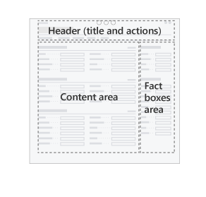
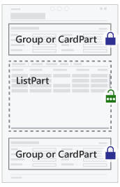
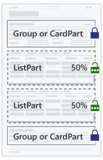
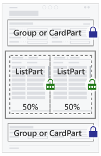
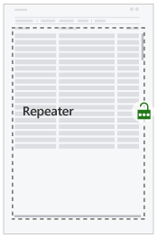
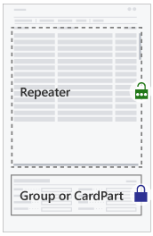
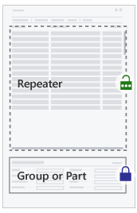
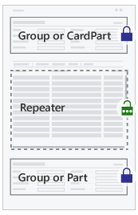
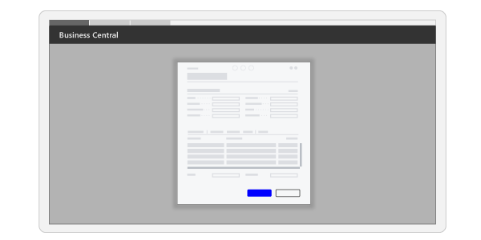

# Page Types and Layouts

Understanding how [!INCLUDE[prodshort](includes/prodshort.md)] displays a page dependent on its *page type* is important to be able to create a good user experience. There are also several page properties and variations of the page structures that can help create an intuitive and efficient user interface.

## Understanding page types 

Choosing the right page type is the first step when creating or modifying a page. The next step is to organize the page contents to suit its purpose in your solution. We recommend that you design pages based on the user tasks that you want to support. 

The following table provides an overview of the page types supported in [!INCLUDE[prodshort](includes/prodshort.md)], their typical uses, and basic characteristics. 

|Page type|Examples of use|Main data display|Characteristics|
|---------|---------------|----------------|---------------|
|`RoleCenter`|Overview of business performance and the start page for a specific user profile.|Defined by the included parts.|A collection of parts (Cues, KPIs, etc.) and the contents of the navigation pane.|
|`Card`|Master, reference, and set up data management. [Card page example](devenv-simple-card-page-example.md)|Single entity|Titled entity with FastTabs. May include parts.|
|`Document`|Transaction and other document management.|Single entity|Titled entity with FastTabs. Should have the document lines ListPart as the second section.|
|`ListPlus`|Statistics, details, and related data management.|Single entity|Titled entity with FastTabs. Usually includes at least one `ListPart`.|
|`List`|Entity overviews and navigation, and inline editing of simple entities. [List page example](devenv-simple-list-page-example.md)  |Collection of entities/entries|A single list with a caption. May have field groups and subpages above and below the list’s `Repeater`.|
|`Worksheet`|Line-based data entry tasks (such as journals) and inquiries.|Collection of entities|A single list or table with a caption. May have field groups and subpages above and below the worksheet’s `Repeater`.|
|`StandardDialog`|Routine dialog that starts or progresses a task.|Single or collection|A cancelable dialog with an instruction to the user. Can have one or more groups of fields, a list, and parts.|
|`ConfirmationDialog`|Confirmative or exceptional dialog, such as warnings.|Single or collection|A Yes/No dialog with an instruction to the user. Can have one or more groups of fields, a list, and parts.|
|`NavigatePage`|Multi-page dialog (also known as a "Wizard").|Single or collection|Can have one or more groups of fields, a list, and parts.|
|`CardPart`|A page that is included in another page, e.g. a FactBox.|Single entity|Single group of fields representing fields in a FastTab.|
|`ListPart`|A page that is included in another page, e.g. a FactBox.|Collection of entities/entries|Single `Repeater` representing columns in a list or table.|

### The two principal page types 

A fundamental characteristic of a page type is how it relates to the data presented on the page. Two principal ways exists: *entity*-orientation (typical for the `Card` page type) and *collection*-orientation (typical for the `List` page type.) 

|`Card`, `Document`, and `ListPlus`|`List` and `Worksheet`|
|---------|---------------|
|||
|The **entity-oriented** page types have actions (in top and in action bar) that affect the entity or context given by the title of the page.|The **collection-oriented** page types provide actions in action bar (and on the rows' action menu) that take effect on the selected row(s) in the collection.|

#### Entity-oriented pages 

In [!INCLUDE[prodshort](includes/prodshort.md)], entity-oriented pages are used to support users when their tasks evolve around a single business entity. The most typical entity-oriented task page is the `Card`, which provides details about a single customer or other master data, and the `Document`, which represents a single transaction or other important business event. 

`ListPlus` is also an entity-oriented page type. Unlike `Card` and `Document` pages, the `ListPlus` page type is for pages that have a prominent `ListPart` and either few or no header fields.

The `CardPart` page type is an entity-oriented page type for inclusion in another page, e.g. as a Factbox.

> [!NOTE]  
> Since entity-oriented pages represent a *single* entity, such as a customer or an item, we recommend that you do not use a `Repeater` group in the construction of entity-oriented pages. However, an entity-oriented task page *can* include a list part page that, in turn, contains a `Repeater` group.

#### Collection-oriented pages 

In [!INCLUDE[prodshort](includes/prodshort.md)], collection-oriented pages are used to support users when their tasks involve multiple entities or records at the same time. The most typical collection-oriented page type is the `List` (e.g. showing customers, items, etc.) from which the user can seek out the entities to work with.

The `Worksheet` is the other prominent collection-oriented page type, suited for data entry (e.g. in journal pages) and other tasks related to managing a set of entities/entries based on custom fields above and/or below the collection.

The `ListPart` page type is a collection-oriented page type for inclusion in another page, e.g. as a Factbox.

#### Dialog pages

The page types in [!INCLUDE[prodshort](includes/prodshort.md)] that are available exclusively for displaying dialogs, such as the `StandardDialog` and `ConfirmationDialog` page types, can represent an entity *or* a collection. The title caption and actions are suited for both types.

## Composing pages 

Within a page, the developer can combine page fields into groups. This can help the user overview the page by placing related fields together. And within a group, *subgroups* can further increase the structure of the data displayed in a page. 

Besides adding fields and groups to a page, it is possible to include another page of type `CardPart` or `ListPart`. (These two page types can in turn not include other pages.) 

When pages are created that include parts, [!INCLUDE[prodshort](includes/prodshort.md)] divides the available screen real estate between the page’s groups of fields and any included pages. Screen space is divided between field groups and included pages such that the user can get access to the full contents of the page and collapse/expand specific sections of interest. 

How space allocation takes place for a given page depends on the chosen page type, the structure of page contents (field groups and page parts), and on the size of the browser window.

### A page is Content + Actions + Factboxes

For all task pages, i.e. excluding dialogs and part pages, there is a common structure to the areas of a page where content, factboxes, and actions can be displayed.

The 'content' area provide rich layout capabilities which are described in the coming sections. The 'factboxes' area is limited to show a list of parts, usually in a vertical arrangement. The header consists of the title, action bar, and controls for filtering, views, etc.

For more information about page areas, see [Pages Overview](devenv-pages-overview.md). 

### Field groups and page parts 

In the following sections are descriptions of typical page layouts, recommendations for how to organize the contents, and illustrations of the principles by which the sections of page share screen real estate. The types of content on a page are illustrated this way:

|Symbol|Section|Notes|
|---------|---------------|----|
||Group of fields, or CardPart|Appears on the page as a FastTab, with fields wrapped in one or more columns.|
||ListPart|List or table layout, with integrated action bar.|
||Repeater|List or table layout.|

### Sizing of page sections

The groups of fields and page parts making up a page are rendered when the user opens the page.

Dependent on the size of the available screen real estate, e.g. in the browser window on a desktop computer, [!INCLUDE[prodshort](includes/prodshort.md)] sizes the sections automatically to make the most of the space.

There are three different ways a section's size are determined. 

|Symbol|Layout behavior|Notes|
|---------|---------------|----|
||Size to content|Enclosing page will use a scrollbar if needed.|
||Size to content within certain limits|The part will use a scrollbar if content exceeds available space.|
||Size to fill space|The part will use a scrollbar if content exceeds available space.|

Which of the section sizing behavior is used is dependent on the chosen page type. For each of the page types described in the sections below, we present the typical layouts, and the way that the sections are sized.

## Card and Document page layouts 

The primary purpose of Card pages is to support users managing master and reference data, such as Customer, Vendor, and Item entities. (The name *Card* refers to how this kind of business data was kept on paper cards in filing cabinets before being computerized.) The Card page type is also often used for setup pages.

The Document pages’ primary purpose is to represent a transaction or other important event in the domain of business. Document pages are the computerized counterpart to paper-based documents (quotes, invoices, orders, etc.), and as such, document pages often have associated workflow or audit trail requirements.

Below are examples of Card and Document page compositions, showing how space is divided. Parts can be combined in more ways than shown here to suit different scenarios.

|Example 1|Example 2|Example 3|
|---------|---------------|----|
|Field groups are placed vertically from top to bottom of the page.|A ListPart can be included. In this case, the ListPart’s height is limited.|When a ListPart is included as the last part on the page, it will expand to fill space.|
||||

From the user’s perspective, the following are qualities of a well-designed card or document page:

- Uses the page type `Card` if the page represents master or reference data, or is a setup page.
- Uses the page type `Document` if the page represents a transaction or other important event in the domain of business.
- Has a page title that clearly identifies the data represented in the page.
- Is optimized for overview by organizing data in FastTabs and marking relevant fields as `Promoted` or `Additional`.
- Favors header fields and other important fields by placing them in a FastTab titled General that come first on the page.
- Includes one or two FactBoxes to give relevant statistics and quick access to related documents.
- For Document pages, a FastTab titled *Lines* comes second on the page with the document lines.

> [!NOTE]  
> The Document page type allows the first ListPart on the page to use additional vertical space before showing a scrollbar. This allows more space for showing the document lines without requiring the user to scroll.

## ListPlus page layouts 

The ListPlus pages’ primary purpose is to support users in managing or browsing a collection of data, e.g. entries, related to a specific business entity or event. For example, the *Customer Sales* page is a ListPlus page that shows sales numbers for a customer and providing dedicated viewing options for sales analysis.

The ListPlus page type is a versatile means to support analysis and management tasks in a specific entity context (named by the page title). ListPlus pages can show persistent data about the entity/event in addition to giving options for how data is viewed or filtered.

A ListPlus page should generally not contain a repeater group but will typically include a `ListPart` page that in turn includes a repeater group. In addition, a ListPlus page can include groups of fields and cardparts. Below are examples of ListPlus page compositions, showing how space is divided. Parts can be combined in more ways than shown here to suit different scenarios.

|Example 1|Example 2|Example 3|
|---------|---------------|----|
|Page sections are placed from top to bottom. The first ListPart fills vertical space.|When placing two (or more) ListParts, they will share available vertical space.|When placing two ListParts in a group, they share horizontal space.|
||||

From the user’s perspective, the following are qualities of a well-designed ListPlus page:

- Has a page title that clearly identifies the context for the information presented in the page.
- Is optimized for showing one set of details, and giving the user means to work with them.
- Presents information in the page in such a way that the hierarchy can be understood when read from top to bottom.
- If present, fields that control which data is presented in another FastTab come before that FastTab.
- If present, fields that show data dependent on the chosen row (in the ListPart) come after the ListPart.

## List page layouts

List pages support users viewing and finding specific entities or entries in a collection. Lists that are editable have cells available for data entry and update.

List pages must contain a single `Repeater` group. In addition, a list can include groups of fields, card parts, and list parts. Below are examples of list page compositions, showing how space is divided. Parts can be combined in more ways than shown here to suit different scenarios.

|Example 1|Example 2|Example 3|
|---------|---------------|----|
|The repeater group assumes full vertical space.|When a field group or cardpart is included, space for repeater is reduced.|When a listpart is included, space is shared equally between part and repeater.|
||||

From the user’s perspective, the following are qualities of a well-designed List page:

- Defines a set of columns that is optimized for viewing and filtering the given collection. Optimize the column order for data entry if the list is editable.
- Has a page title that clearly names or identifies the collection of entities/entries presented.
- If a summary or additional detail related to the selected row are shown, these appear below the list.
- If custom viewing options are available, these appear above the list.
- Includes one or two FactBoxes to give essential collection statistics, and relevant related details for the selected row.

## Worksheet page layouts

A Worksheet page lets users view and manage a collection of entries in tabular or matrix form. It is well suited for cases when a custom filter or a set of default field values is the basis for users’ work with the collection, such as with journals (which typically involves data entry) and inquiry pages (which is for querying data).

> [!NOTE]  
> The Worksheet page type does not support the same part and group compositions as the List page type.

Worksheet pages must contain a single `Repeater` group. In addition, a worksheet can include groups of fields, cardparts, and listparts. Below are examples of list page compositions, showing how space is divided. Parts can be combined in more ways than shown here to suit different scenarios.

|Example 1|Example 2|Example 3|
|---------|---------------|----|
|The Repeater group takes full vertical space, leaving space for groups above and below.|If a ListPart is included, the vertical space is shared with Repeater.|When a ListPart is included, space is shared equally between part and Repeater.| 
||||

From the user’s perspective, the following are qualities of a well-designed worksheet page:

- Defines a set of columns that is optimized for overviewing and managing the given collection. Columns are ordered relative to their importance.
- Has fields above the grid that specify filtering options or specify the default values effective during data entry and editing in the grid.
- If summary fields or additional details of the selected row are shown, these appear below the repeater.

## Dialog page layouts 

Some page types in [!INCLUDE[prodshort](includes/prodshort.md)] are available exclusively for displaying dialogs, such as the `StandardDialog` and `ConfirmationDialog` page types. In addition, there are programmatic ways in AL to display a dialog to the user with the Dialog data type, as well as dialogs defined as report request pages.

It is also possible to use the common page types (`Card`, `Document`, `List`, etc.) to present a dialog to the user. In this case, pages are created, composed, and can include the same elements, as when displayed ordinarily. Presenting the page to the user as a dialog requires certain AL code that activates the dialog mode. When this happens, the page is shown with dismiss buttons in the page footer.

Generally, [!INCLUDE[prodshort](includes/prodshort.md)] displays dialogs on the screen in a frame that is more narrow and not taking up full vertical height, compared to how pages appear ordinarily. Aside from that, pages lay out their contents according to the same principles, whether displayed as a dialog or not.

Given the size of the screen where the dialog appears, more or less of the page contents will be visible without scrolling. When a page page can contain a lot of contents, it is possible for the user increase the dialog size with the maximize button.
 
## See Also

[Page Properties Overview](properties/devenv-page-property-overview.md)  
[Actions Overview](devenv-actions-overview.md)  
[Using Designer](devenv-inclient-designer.md)  
[Adding a Factbox to a Page](devenv-adding-a-factbox-to-page.md)  
[Designing Role Centers](devenv-designing-role-centers.md)  
