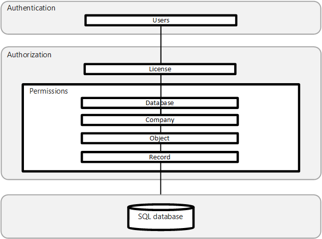

# Application Security in Business Central

This section helps you understand and improve the security of your Business Central application regardless of where it is hosted.  In the articles listed below you will find guidance and recommended practices related to authentication, authorization and auditing, as well as data encryption and secure development practices that can be applied to any Business Central environment.

The following diagram provides an overview of the application security. 

## Authentication

Before users can sign-in to the application, they must be authenticated as valid user in the system. Business Central supports several authentication methods. You configure the authentication method on the server-tiers of Business Central. For more information, see the following articles:

[Managing Users and Permissions](https://docs.microsoft.com/en-us/dynamics365/business-central/ui-how-users-permissions)

[User Authentication](https://docs.microsoft.com/en-us/dynamics365/business-central/dev-itpro/security/user-security#user-authentication)  

[Multi-factor Authentication](../administration/nultifactor-authentication.md)
 
[Authentication and Credential Types](../administration/users-credential-types.md)

## Authorization

[New paragraph on layered auth system + picture]

[User permissions in the application](user-security.md#user-permissions-in-the-application)

[Database Level](data-security.md?tabs=database-level)

[Managing Users and Permissions](https://docs.microsoft.com/en-us/dynamics365/business-central/ui-how-users-permissions)

[Removing Elements from the User Interface According to Permissions](../administration/hide-ui-elements.md)  

## Auditing

[Authorization assessment](https://docs.microsoft.com/en-us/dynamics365/business-central/ui-how-users-permissions#to-get-an-overview-of-a-users-permissions)
  
[Data auditing](https://docs.microsoft.com/en-us/dynamics365/business-central/across-log-changes)
  
[Security auditing](security-auditing.md)

[Data classification](https://docs.microsoft.com/en-us/dynamics365/business-central/admin-classifying-data-sensitivity)
  
## Data Encryption

You can encrypt data on the Business Central server by generating new or importing existing encryption keys that you enable on the Business Central server instance that connects to the database.

[Data encryption](https://docs.microsoft.com/en-us/dynamics365/business-central/admin-manage-data-encryption)  

## See Also  

[Security Development Lifecycle](https://www.microsoft.com/en-us/sdl)  